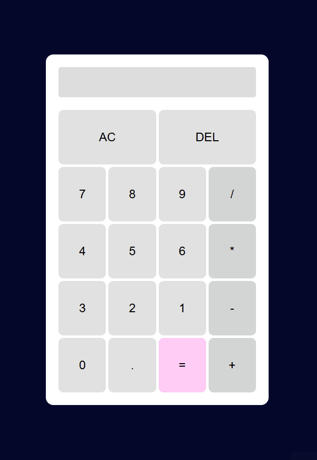

# Калькулятор на JavaScript

Простой, но функциональный веб-калькулятор с красивым дизайном и поддержкой цепочек вычислений. Проект создан для отработки навыков работы с DOM-событиями, CSS Grid и логикой вычислений на чистом JavaScript.

### Главный экран

### Пример вычисления: 5 + 3 = 8

## Функциональность

-  **Базовые операции**: сложение, вычитание, умножение, деление
-  **Ввод чисел с плавающей точкой**: защита от ввода нескольких точек
-  **Полная очистка (AC)**: сбрасывает все данные
-  **Удаление последнего символа (DEL)**: удобно при ошибках ввода
-  **Цепочки вычислений**: поддерживает выражения вида `5 + 3 - 2 = 6`
-  **Защита от деления на ноль**: показывает сообщение об ошибке
-  **Адаптивный и красивый дизайн**: приятные цвета, hover-эффекты, тени
-  **Полное управление с мыши**: все кнопки кликабельны

##  Технологии

- **HTML5**: семантическая разметка
- **CSS3**: Flexbox, Grid, кастомные свойства, адаптивность
- **JavaScript (ES6+)**:
  - Обработка событий (делегирование)
  - Методы массивов и строк
  - Управление состоянием
